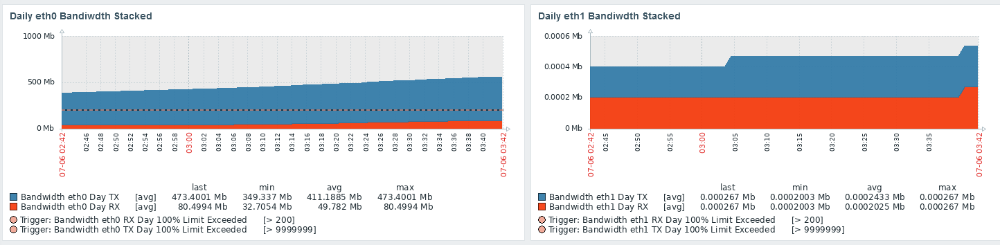
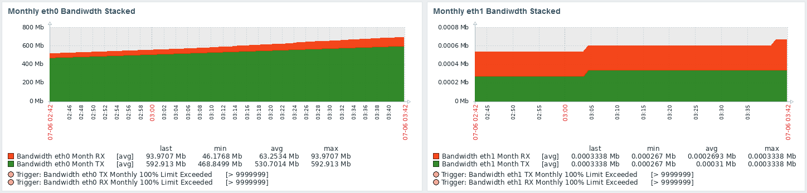
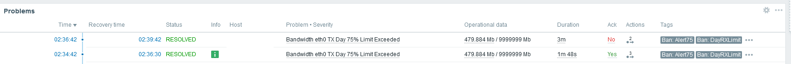

# Zabbix_Bandwidth-vnstat
Zabbix Template - Get Daily, Monthly and All time Bandwidth Information /w Discovery & Triggers


-----------

## Features
- Zabbix Agent (Active)
- Bandwidth by Day/Month/All Time
- Bandwidth by Receive/Transmit/Total
- LLD **Discovery** using vnstat
- **Graphs** For each Day/Month/All Time per Receive/Transmit/Total/Stacked
- **Dashboard** for Bandwidth Items
- **Macros** to set Daily/Monthly Bandwidth Limits for Receive/Transmit/Total Triggers
- **Triggers**
  - 50%/75%/100% Daily Limit for Receive/Transmit/Total (INFO/WARN/HIGH)
  - 50%/75%/100% Monthly Limit for Receive/Transmit/Total (INFO/WARN/HIGH)
  - Zero configured vnstat interfaces (INFO)

----------------------


## installation
Install vnstat, copy Zabbix Agent configuration (user parameters), import template, assign hosts, modify trigger macros.


### Install vnstat
On monitored host, install vnstat
```
apt-get update
apt-get install vnstat
service vnstat restart
```
Note: using vnstat 2.6 does not require additional configuration.

### Configuration File
Add config/bandwidth-vnstat.conf to your Zabbix-Agent configs folder (usually  /etc/zabbix/zabbix_agentd.conf.d/)
```
cp  config/bandwidth-vnstat.conf /etc/zabbix/zabbix_agentd.conf.d/bandwidth-vnstat.conf
```

### Restart Zabbix Agent
```
service zabbix-agent restart
```

### Import Template
Import the Bandwidth-vnstat.yaml template into Zabbix.

### Assign hosts
Assign a host to the 'Bandwidth by vnstat - Active Agent' Template

### Update Macros
For each host, edit the inherited macro's to set the appropriate bandwidth limit for triggers.

--------------------


## Notes
Reminder that the default configuration for vnstat is to query the network interfaces every 60 seconds but update the back-end database only every 5 minutes.  Consequently, Zabbix-Agent will receive updated bandwidth data from vnstat only every 5 minutes.  It may be appropriate to update the query time for the Bandwidth items to match the vnstat database update, or modify the vnstat configuration to update the back-end database every 60 seconds.

## Screenshots
Dashboard Screenshot (Daily Bandwidth Stacked)


Dashboard Screenshot (Monthly Bandwidth Stacked)


Problem Alert Showing Bandwidth Limits (Operational Data)


## Last Update
October 1, 2021
- bug fixes
November 17, 2021
- Added XML for pre 5.4

## Known Issues
- LLD does not filter for invalid interface names.  This will be addressed in future release

# Contact
- Twitter: @KRelkci
- Github: @Relkci

# Special Thanks
- Black Hills Information Security - https://www.blackhillsinfosec.com
